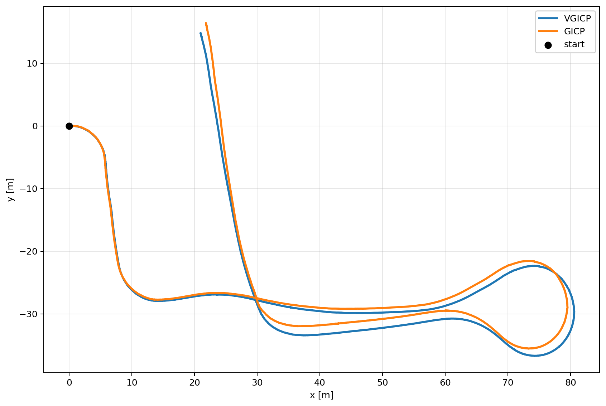

# small_lidar_inertial_dead_reckoning

A lightweight **ROS 2 workspace for LiDAR + IMU dead reckoning**.

The default pipeline has two required stages:

1. `pure_imu_undistortion` deskews each LiDAR scan using IMU data.
2. `pure_lidar_gyro_odometer` estimates relative motion from the deskewed point cloud and IMU.

GNSS-related packages are included in this workspace, but **GNSS is optional**.
The default launch configuration uses `use_gnss:=false`, so you can run the system as a **LiDAR + IMU-only dead-reckoning pipeline** without any GNSS sensor or topic.

## Features

- Compact ROS 2 LiDAR/IMU odometry workspace
- IMU-based LiDAR deskew / undistortion
- Scan-to-scan LiDAR odometry
- Gyro bias estimation during stops
- Stop detection and corrected IMU output
- `small_gicp` as the default registration backend
- Optional lightweight GNSS fusion for absolute positioning
- Both composable-node and standalone-node launch files

## LiDAR + IMU dead-reckoning example

The figure below shows an example estimated trajectory using **LiDAR + IMU only**.
**No GNSS is used in this example.**
The two trajectories are aligned at the start point for easier visual comparison.

- Blue: `VGICP`
- Orange: `GICP`
- Black dot: start point



This plot is intended as a qualitative example of the dead-reckoning output, not a ground-truth benchmark.

## Overall architecture

```text
[Required pipeline: works without GNSS]

/converted_points -----------------------> pure_imu_undistortion -----------------> /localization/points_undistorted
/imu -----------------------------------^

/localization/points_undistorted -------> pure_lidar_gyro_odometer -------------> /localization/gyro_lidar_odom
/imu -----------------------------------^                                      +-> /localization/twist
                                                                                +-> /localization/imu_corrected
                                                                                +-> /localization/is_stopped

[Optional pipeline: only when GNSS is enabled]

/ublox_gps_node/fix --------------------> pure_gnss_conversion ------------------> /localization/global_pose
/ublox_gps_node/fix_velocity ----------->                                   +----> /localization/gnss_odometry
/localization/imu_corrected ----------->                                    +----> /localization/gnss_fusion_input

/localization/gyro_lidar_odom ----------> pure_gnss_map_odom_fusion -----------> /localization/ekf_pose
/localization/gnss_fusion_input ------->                                     +---> /localization/ekf_odom
```

## Packages included

| Package | Role | Required / Optional |
|---|---|---|
| `pure_imu_undistortion` | LiDAR motion deskew using IMU | Required |
| `pure_lidar_gyro_odometer` | LiDAR + IMU odometry / dead reckoning | Required |
| `pure_odometry_bringup` | Launch files and diagnostic aggregation | Required |
| `small_gicp` | Point cloud registration backend | Required |
| `ndt_omp` | Registration library dependency | Required |
| `pure_gnss_msgs` | Message definitions for GNSS fusion | Optional |
| `pure_gnss_conversion` | Converts `NavSatFix` and Doppler velocity into local GNSS data | Optional |
| `pure_gnss_map_odom_fusion` | Lightweight map/odom fusion of GNSS and odometry | Optional |

## Requirements

- ROS 2 workspace environment
- LiDAR point cloud input (`sensor_msgs/msg/PointCloud2`)
- IMU input (`sensor_msgs/msg/Imu`)
- At least the following TFs:
  - `base_link -> velodyne` (or your actual LiDAR frame)
  - `base_link -> imu` (recommended; otherwise the IMU is treated as if it were already in `base_link`)
  - `base_link -> gnss_antenna` (only when GNSS is enabled)

## Build

This repository is a workspace root.
If you cloned it from Git, initialize submodules first.
If you are using the provided zip archive, the third-party sources are already included.

```bash
cd <this_workspace_root>

git submodule update --init --recursive

source /opt/ros/<ros_distro>/setup.bash
rosdep install --from-paths src --ignore-src -r -y
colcon build --symlink-install --cmake-args -DCMAKE_BUILD_TYPE=Release
source install/setup.bash
```

Notes:

- `small_gicp` and `ndt_omp` are included as third-party source trees
- Dependencies are expected to be resolved with `rosdep`
- Replace `<ros_distro>` with your ROS 2 distribution name

## Quick start: LiDAR + IMU only (no GNSS)

### 1. Publish the required static TFs

The following values are only examples.
Replace them with your actual extrinsic calibration.

```bash
ros2 run tf2_ros static_transform_publisher 0 0 0 0 0 0 base_link velodyne

ros2 run tf2_ros static_transform_publisher 0 0 0 0 0 0 base_link imu
```

### 2. Launch the pipeline

Composable-node version:

```bash
ros2 launch pure_odometry_bringup odometry_container.launch.py
```

Standalone-node version:

```bash
ros2 launch pure_odometry_bringup odometry_standalone.launch.py
```

Both launch files default to `use_gnss:=false`.
That means **GNSS topics and GNSS hardware are not required**.

### 3. Play a rosbag (optional)

If your input topic names differ from the defaults, remap them when playing the bag.
For example:

```bash
ros2 bag play <bag_dir> --clock --remap <lidar_topic>:=/converted_points --remap <imu_topic>:=/imu
```

If you use simulated time, also pass `use_sim_time:=true` to the launch file.

```bash
ros2 launch pure_odometry_bringup odometry_container.launch.py use_sim_time:=true
```

## Default topics (without GNSS)

### Inputs

| Topic | Type | Default |
|---|---|---|
| LiDAR points | `sensor_msgs/msg/PointCloud2` | `/converted_points` |
| IMU | `sensor_msgs/msg/Imu` | `/imu` |
| Velocity input for translational deskew (optional) | `geometry_msgs/msg/TwistStamped` | unused when `twist_topic` is empty |
| Wheel speed (optional) | `geometry_msgs/msg/TwistStamped` | unused when `wheel_speed_topic` is empty |

### Outputs

| Topic | Type | Description |
|---|---|---|
| `/localization/points_undistorted` | `sensor_msgs/msg/PointCloud2` | Deskewed / undistorted point cloud |
| `/localization/gyro_lidar_odom` | `nav_msgs/msg/Odometry` | LiDAR + IMU dead-reckoning result |
| `/localization/twist` | `geometry_msgs/msg/TwistStamped` | Estimated velocity and yaw rate |
| `/localization/imu_corrected` | `sensor_msgs/msg/Imu` | IMU corrected into the `base_link` convention |
| `/localization/is_stopped` | `std_msgs/msg/Bool` | Stop-state estimate |
| `/diagnostics` | `diagnostic_msgs/msg/DiagnosticArray` | Per-node diagnostics |
| `/diagnostics_agg` | `diagnostic_msgs/msg/DiagnosticArray` | Aggregated diagnostics |

## Parameter files

The default parameter files are:

- `src/pure_imu_undistortion/param/param.yaml`
- `src/pure_lidar_gyro_odometer/param/param.yaml`
- `src/pure_gnss_conversion/param/param.yaml` (only when GNSS is enabled)
- `src/pure_gnss_map_odom_fusion/param/param.yaml` (only when GNSS is enabled)

Override example:

```bash
ros2 launch pure_odometry_bringup odometry_container.launch.py imu_param:=/path/to/imu.yaml odom_param:=/path/to/odom.yaml
```

If you use GNSS, you can also override the GNSS parameter files:

```bash
ros2 launch pure_odometry_bringup odometry_container.launch.py use_gnss:=true gnss_param:=/path/to/gnss.yaml gnss_fusion_param:=/path/to/gnss_fusion.yaml
```

## Frequently tuned parameters

### `pure_imu_undistortion`

| Parameter | Meaning |
|---|---|
| `base_frame` | Base vehicle frame |
| `imu_frame` | IMU frame name |
| `scan_frame` | LiDAR frame name. If empty, the input point cloud `header.frame_id` is used |
| `points_in_topic` | Input point cloud topic |
| `points_out_topic` | Output point cloud topic |
| `imu_topic` | IMU topic |
| `time_fields` | Candidate per-point time fields (`time`, `t`, `timestamp`, etc.) |
| `fallback_scan_period` | Scan period used when the point cloud has no point-wise time field |
| `use_translation` | Enables translational deskew |
| `twist_topic` | Velocity input used for translational deskew |

### `pure_lidar_gyro_odometer`

| Parameter | Meaning |
|---|---|
| `points_topic` | Input point cloud, usually `/localization/points_undistorted` |
| `imu_topic` | IMU input |
| `out_odom_topic` | Odometry output |
| `out_twist_topic` | Twist output |
| `out_imu_topic` | Corrected IMU output |
| `lidar_odom.backend` | Default: `SMALL_GICP` |
| `lidar_odom.registration_type` | Default: `GICP` |
| `lidar_odom.voxel_leaf_m` | Downsampling voxel size |
| `lidar_odom.gicp.*` | GICP registration settings |
| `stop.*` | Stop-detection thresholds |
| `gyro_bias.*` | Gyro-bias estimation during stationary periods |
| `wheel_speed.*` | Wheel-speed mode settings |

### About ZUPT / NHC

The mini-smoother in `pure_lidar_gyro_odometer` supports the following optional factors:

- `lidar_odom.smoother.zupt.*`: ZUPT constraints during detected stops
- `lidar_odom.smoother.nhc.*`: NHC constraints to suppress lateral slip

The code-level defaults are `false`, but the bundled `param.yaml` currently enables both.
If you do not want them, set them explicitly to `false`.

### Frequently adjusted GNSS parameters

| Parameter | Meaning |
|---|---|
| `p0`, `gnss0` | Local-map origin correspondence |
| `antenna_frame_id` | GNSS antenna frame |
| `sync_tolerance_sec` | Allowed time mismatch between `fix` and `fix_velocity` |
| `odom_topic` | Odometry input for fusion |
| `gnss_input_topic` | Input from `pure_gnss_conversion` |
| `gnss_base_alpha_xy`, `gnss_base_alpha_yaw` | Base fusion gains for GNSS updates |

## Optional GNSS pipeline

Enable the following nodes only when GNSS is required:

- `pure_gnss_conversion`
- `pure_gnss_map_odom_fusion`

### Additional requirements

- Static TF: `base_link -> gnss_antenna`
- `sensor_msgs/msg/NavSatFix`
- `geometry_msgs/msg/TwistWithCovarianceStamped` for Doppler velocity

### Default GNSS-related launch arguments

| Launch argument | Default |
|---|---|
| `gnss_fix_topic` | `/ublox_gps_node/fix` |
| `gnss_fix_velocity_topic` | `/ublox_gps_node/fix_velocity` |
| `gnss_global_pose_topic` | `/localization/global_pose` |
| `gnss_odom_topic` | `/localization/gnss_odometry` |
| `gnss_fusion_input_topic` | `/localization/gnss_fusion_input` |

### Launch example with GNSS enabled

```bash
ros2 run tf2_ros static_transform_publisher 0 0 0 0 0 0 base_link gnss_antenna

ros2 launch pure_odometry_bringup odometry_container.launch.py use_gnss:=true
```

### Main outputs when GNSS is enabled

| Topic | Type | Description |
|---|---|---|
| `/localization/global_pose` | `geometry_msgs/msg/PoseStamped` | GNSS position in local coordinates |
| `/localization/gnss_odometry` | `nav_msgs/msg/Odometry` | GNSS-derived absolute pose and velocity |
| `/localization/gnss_fusion_input` | `pure_gnss_msgs/msg/GnssFusionInput` | Fusion input message |
| `/localization/ekf_pose` | `geometry_msgs/msg/PoseWithCovarianceStamped` | Fused pose in the `map` frame |
| `/localization/ekf_odom` | `nav_msgs/msg/Odometry` | Fused odometry |

## Launch files

| Launch file | Description |
|---|---|
| `src/pure_odometry_bringup/launch/odometry_container.launch.py` | Composable-node version |
| `src/pure_odometry_bringup/launch/odometry_standalone.launch.py` | Standalone-process version |

Main launch arguments:

| Argument | Default | Description |
|---|---|---|
| `use_gnss` | `false` | Whether to start GNSS nodes |
| `use_sim_time` | `false` | Whether to use simulated time |
| `log_level` | `info` | Logging level |
| `imu_param` | default YAML | IMU undistortion settings |
| `odom_param` | default YAML | Odometry settings |
| `gnss_param` | default YAML | GNSS conversion settings |
| `gnss_fusion_param` | default YAML | GNSS fusion settings |

## Notes and limitations

- **GNSS is not required.** Start with the default `use_gnss:=false` setting.
- When `wheel_speed.use=true`, the current implementation disables LiDAR odometry.
- `pure_lidar_gyro_odometer` publishes `nav_msgs/Odometry`, but by itself it does **not** publish TF.
- When enabled, `pure_gnss_map_odom_fusion` can publish fused `map`-frame pose / odometry and TF.
- `pure_imu_undistortion` uses TF internally for coordinate conversion, while the output point cloud keeps the input `header.frame_id`.
- `run_vehicle_localizer_wait_topics.sh` is a local helper script for bag playback and topic monitoring. It is environment-specific and may need adjustment before use.

## Diagnostics

`pure_odometry_bringup` launches `diagnostic_aggregator`.
You can inspect the aggregated diagnostic output with:

```bash
ros2 topic echo /diagnostics_agg
```

## Third-party components

This workspace includes the following third-party components:

- `small_gicp` (`src/small_gicp`) — MIT license
- `ndt_omp` (`src/ndt_omp`) — BSD-2-Clause license

See `THIRD_PARTY_NOTICES.md` and the corresponding `LICENSE` files inside each component for details.

## License

Unless otherwise noted in a subdirectory, the code in this repository is provided under the **Apache License 2.0**.
See the top-level `LICENSE` file.

Bundled third-party components keep their own licenses:

- `src/small_gicp`: MIT
- `src/ndt_omp`: BSD-2-Clause
